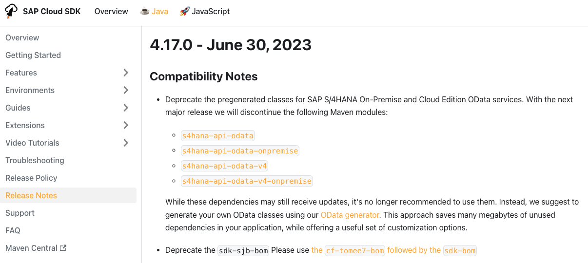
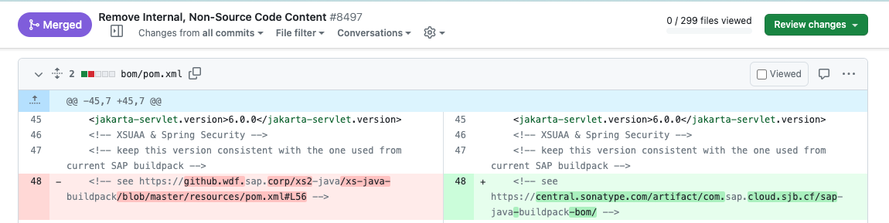
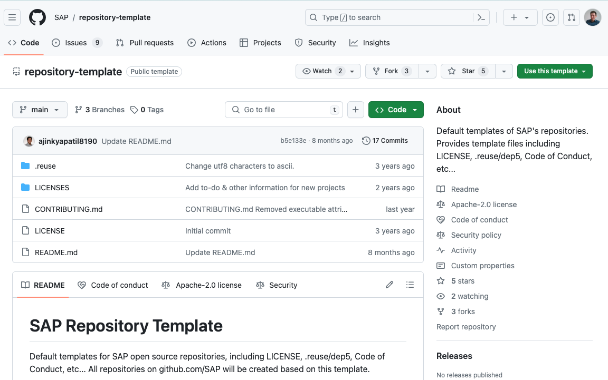

# Open Sourcing the SAP Cloud SDK for Java: Part 1 - Preparations

The [SAP Cloud SDK for Java](https://sap.github.io/cloud-sdk/docs/java/overview-cloud-sdk-for-java) is a library that helps you develop Java applications on the SAP Business Technology Platform (BTP).
While its [sister-version for JavaScript](https://github.com/sap/cloud-sdk-js/) has been open source since 2020, the [Java version](https://github.com/SAP/cloud-sdk-java) has been open sourced only recently with the [release of version 5.0.0](https://community.sap.com/t5/technology-blogs-by-sap/released-sap-cloud-sdk-for-java-version-5/ba-p/13576668).

This blog post is the first in a series where I go over the process of how we moved the SAP Cloud SDK for Java from an internal code base and development ecosystem to an open source project on GitHub.
This has been a journey that spun across 10 months and involved a lot of planning, coordination and technical work.
We started planning the process in the beginning of 2023 and finally released version 5.0.0 as the first open source version of the project on December 5th, 2023.
Of course, during this time we also worked on other features and improvements for the SDK, but the open source migration was a significant part of our work.

This first blog post covers some of the non-technical planning and preparation that was necessary to open source the project.
Parts [two](./oss-part2.md) and [three](./oss-part3.md) will cover the technical migration steps of the codebase itself and the development ecosystem around it.

## Why Open Source?

Choosing to open source the SAP Cloud SDK for Java was a strategic decision, aiming for multiple long term benefits:

* First, open sourcing the project makes it easier for all developers to use the library.
  It allows users to quickly peek into the source code to better understand some implementation, to ask for help on the issues tab of the repository or to contribute themselves.
* Second, it also allowed us to modernize and simplify our tools to build the SDK.
* Last, but not least, it allows us to engage more with the developer community and promotes transparency and trust.

These were some of the reasons that ultimately motivated us to take on the challenge of moving the project to open source.

## Finding a Starting Point

At SAP, we have a dedicated team that helps other teams within SAP open-source their projects: The Open Source Program Office of SAP (OSPO).
You can read more about them in this blog post from Michael: [Managing Open Source Software with an Open Source Program Office](https://community.sap.com/t5/open-source-blogs/managing-open-source-software-with-an-open-source-program-office/ba-p/13516761).

So, the first step was to get in touch with the OSPO and discuss our plans.
They helped us understand the requirements and the necessary steps we'd have to take for going open source.

## Taking the First Steps

The first step was to evaluate which parts of the productive codebase were (not) eligible for open sourcing.
The code base had grown since its inception in 2016 and contained some functionality that was either not central to the product, only used internally or legacy code.

We knew that the core functionality of the SDK (e.g. the destination service integration, the OData APIs, the multi-tenancy and resilience features) could be moved to open source without issues.
But there were other parts where it was either not immediately clear, or the functionality was completely SAP-internal and not released to Maven Central.

We had to deal with two main categories of code that we had to either remove or replace:

1. Code that contained SAP intellectual property (IP) and was not eligible for open sourcing.
2. Code that used SAP-internal dependencies.

Both categories required an extensive review of the codebase, its dependencies and the functionality provided by the code.

For example, we found that the pre-generated OData clients for SAP S/4HANA and SAP S/4HANA Cloud were not eligible for open sourcing.
In this case we decided that we would deprecate and remove these clients.
To make up for this, we instead improved the OData generator which was used to generate these clients, so that users can generate their own version of the clients.

In other cases, we decided to remove modules, but ensure the existing modules of version 4 would be compatible with the new version 5 of the SDK.
That way existing users could upgrade to the new version while keeping a select few modules of the old version.
But since this approach has some challenges (one has to keep maintaining the old modules and continuously ensure compatibility with the new version), we only applied this for a few select cases that were small but important enough to justify the effort.

Overall, we had to evaluate each impacted feature case by case.
That meant getting feedback from existing stakeholders, finding and evaluating any potential alternatives and ultimately making a decision.

Considering the relatively large code base of version 4 with well over 100 maven modules this was arguably the most challenging part of the open source migration.
Overall it took several months until we had a clear picture of what we wanted to open source and what we had to remove or replace.

However, because this naturally is a process that takes time, we worked on other aspects of the migration in parallel to that.

## Code Cleanup

While the future of some parts of the code base where still in discussion, we already prepared the rest of the code base to be moved to an open source repository.
For example, this meant removing any internal or personal identifiable information from test code.
But also inspecting internal documents and code comments, removing e.g. links to internal tools or documentation, internal IP addresses or other internal information.

While not strictly necessary in all cases, it was important to us that the code is sensible to all developers, not just SAP internal developers.
Having inaccessible links or references to internal tools would make it difficult for open source contributors to understand and contribute to the code.

Considering the project contained around 1800 productive classes and equally many test classes together with around 100 other files like Markdown documents, configuration files and scripts, this task also took some time.
But after a few weeks and a good bit of search and replace, we were confident that the code base was ready to be open sourced.

## Setting up an Open Source Repository

Now it was time to set up the open source repository.
That meant creating a new repository within the [SAP organization on GitHub](https://github.com/SAP).
For this process the OSPO team has a [repository template](https://github.com/SAP/repository-template) prepared from which new repositories are created.

As part of the process we added the necessary documents and links: We set the new license to be Apache-2.0, added the main readme file, drafted our contribution guidelines and linked the code of conduct.
The OSPO template navigates you through this process and provides you with a comprehensive checklist as well as any SAP-specific standard texts or references that need to be used.

But, since this repository so far effectively only contained a readme, we kept it internal to the SAP organization until we were ready to open source the actual source code.
The actual process of moving over the code base is what I will cover in the [next part](oss-part2.md) of this series.

## What we didn't have to do

Before wrapping up I think it's worth mentioning that there were also some things we didn't have to do.

For example, we didn't have to apply any larger refactorings to deal with functionality we removed or replaced.
Most of the code was already structured into maven modules that were independent enough from each other, so that often we could decide on a per-module basis if and how the code should be open-sourced.

In addition, we already had strong tooling support set up to ensure that the code base was in a good state overall.
This included a comprehensive test suite, but also code scanning tools (e.g. Fortify, Checksytle, PMD etc.) and tools for analyzing dependencies and licenses (e.g. BlackDuck).
This made identifying internal dependencies or finding license issues relatively easy.

And, of course, we had experience from moving the JavaScript variant of the project into open source.
We could also refer to other closely related open source projects such as the [SAP BTP Security Services Integration Libraries](https://github.com/SAP/cloud-security-services-integration-library) or the [SAP BTP Environment Service Binding Access Library](https://github.com/sap/btp-environment-variable-access/).
Together with the help and tools provided by the OSPO team this made the process of moving the Java variant into open source significantly easier.

## Conclusion

Summing up, we had to do quite some planning and preparation to get the SAP Cloud SDK for Java ready for open sourcing.
This was mostly due to the size of the code base and the amount of internal functionality and IP it contained.

But with the help of the OSPO team, the experience from open-sourcing the JavaScript variant and the support from stakeholders we were able to prepare the code base step by step.
In the [next part](oss-part2.md) of this series I will cover the actual process of moving the code base to GitHub and the technical challenges we faced during this process.

What are your experiences with open sourcing projects?
Do you have any questions on the process we went through?
Leave your thoughts in the comments below!