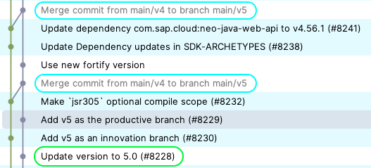
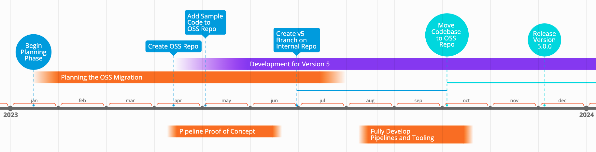

# Open Sourcing the SAP Cloud SDK for Java: Part 2 - Moving Code

The [SAP Cloud SDK for Java](https://sap.github.io/cloud-sdk/docs/java/overview-cloud-sdk-for-java) is a library that helps you develop Java applications on the SAP Business Technology Platform (BTP).
While its [sister-version for JavaScript](https://github.com/sap/cloud-sdk-js/) has been open source since 2020, the [Java version](https://github.com/SAP/cloud-sdk-java) has been open sourced only recently with the [release of version 5.0.0](https://community.sap.com/t5/technology-blogs-by-sap/released-sap-cloud-sdk-for-java-version-5/ba-p/13576668).

This blog post is the second of a series where I go over the process of how we moved the SAP Cloud SDK for Java from an internal code base and development ecosystem to an open source project on GitHub.

[Part one](./oss-part1.md) covered the non-technical planning and preparation that was necessary to open source the project.
This post goes into the details of how we moved the code base over from an internal repository to the open source repository on GitHub.
Finally, [part three](./oss-part3.md) will cover the transformation of the CI/CD pipeline and the surrounding automations.

## The Overall Strategy

Right from the get-go it was clear that we would release a new major version of the SDK once the open source migration was complete.
As outlined in part 1 of this blog post series, the open source version would come with a new license and significant changes to the feature scope, dropping support for some legacy features and platforms.
With the current version being 4.X at the time, we set the goal to release version 5.0.0 as the first open source version of the SDK.

Still, we would have to continue developing the current version 4 for some time, at least up until a few weeks before the release of version 5.
And even after that, we would have to maintain version 4 and provide bug fixes and security updates for some time.

Next, we had decided to replace our existing (Jenkins) pipelines and related tooling (e.g. for static code checks, dependency updates etc.) in favor of more modern alternatives that are more suitable for open source projects.
We decided to completely switch to GitHub Actions for our pipelines and automations, and also use other tools provided by GitHub for code quality and security checks (e.g. CodeQL, Dependabot). 
This would require some time to set up and test. 

Finally, we wanted to have a smooth transition with as little downtime to the development process as possible.
Ideally, we copy over the code to the new repository and have all the CI/CD tooling and automations in place and working,
guaranteeing the same or even better code quality compared to the internal repository.

## How We Moved the Code Base

With these requirements in mind we came up with a plan to move the code base over to the open source repository.
It comprised of three steps:

1. Copy a representative sample of the code to the open source repository and develop the CI/CD pipelines
2. Create a v5 branch in the internal repository and develop the open source version in parallel
3. Move the v5 branch over to the open source repository and press the release button

Copying a sample allowed us to develop the CI/CD pipeline and all related tooling in parallel to the code development.
Also, it allowed us to split the code base as late as possible to reduce the amount of work required to maintain two repositories.

## Creating a Representative Sample

Once we had created the empty repository on GitHub we copied around 5-10 modules or roughly 10 % of the code base over to the open source repository.
We carefully chose a subset of the code that we knew would change relatively little in the near future and that would be representative of the whole code base.
The code sample was representative in the sense that it included various different kinds of Maven modules:
Typical modules that would get shipped as JAR, parent and BOM modules that are used for dependency management, modules that would get shipped as a Maven plugin or Maven archetype and test modules that wouldn't get shipped.

This allowed us to implement our CI/CD pipelines on a subset of the code that would be representative of the whole code base.
Also, this meant this work can be done in parallel and completely independent of the development on the internal repository.

In the end, the sample code allowed us to fully prepare all CI/CD tooling with a high degree of confidence that once we move over the rest of the code base everything would work as expected.

## Splitting and Moving the Code

We then created a v5 branch in the internal repository and started removing any code that would not be open sourced.
We also set up an automation right away that would merge any changes done to v4 automatically into the v5 branch.

That way we could continue developing the current version 4 without the risk of forgetting to port relevant changes to the v5 branch.
Still, maintaining two branches is additional work, so we pushed creating the v5 branch back as far as possible.

Finally, once all changes required for the open source migration on the v5 branch were complete and the open source repository was set up with all required CI/CD tooling we moved over the v5 branch to the open source repository.
This step almost fully replaced the existing code sample we had copied over earlier.
Only the parts relevant to the CI/CD setup were kept and merged with the incoming v5 branch.

On the 2nd of October around 2500 files were copied over from the internal to the open source repository with [this pull request](https://github.com/SAP/cloud-sdk-java/pull/83).
We implemented the necessary adjustments for the CI/CD pipelines to work on the full code base (e.g. adjusting the thresholds for the code scans and test coverage, adjusting the copied over pom.xml files etc.).
This process finished on the 4th of October where the pull request was merged and the internal v5 branch archived.

## Summing Up

Overall, we were quite happy with how the move of the code base went.
Having the work on the pipelines and tooling done independent and in parallel to the development on the internal repository allowed us to not lose any time or sacrifice code quality due to lack of tooling.
It also made it easier to get help from colleagues outside our development team who had more experience with GitHub Actions and helped us set up the pipelines.

Here is a timeline of the overall process:

In the final part of this series I will cover how we used GitHub Actions to implement our all our CI/CD pipelines and how we automated the release process.