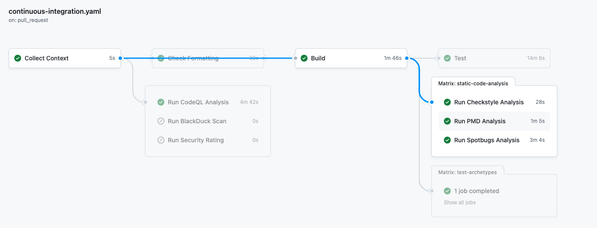
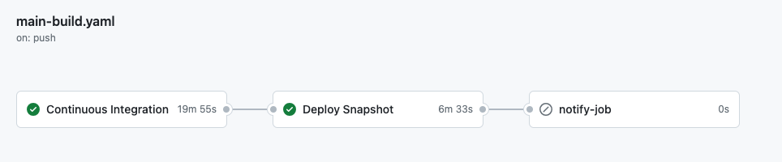
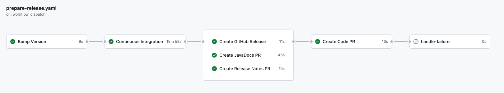
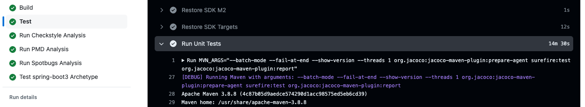
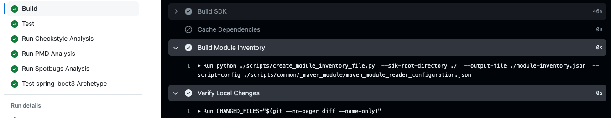

# Open Sourcing the SAP Cloud SDK for Java: Part 3 - Re-Building the CI/CD Automations

The [SAP Cloud SDK for Java](https://sap.github.io/cloud-sdk/docs/java/overview-cloud-sdk-for-java) is a library that helps you develop Java applications on the SAP Business Technology Platform (BTP).
While its [sister-version for JavaScript](https://github.com/sap/cloud-sdk-js/) has been open source since 2020, the [Java version](https://github.com/SAP/cloud-sdk-java) has been open sourced only recently with the [release of version 5.0.0](https://community.sap.com/t5/technology-blogs-by-sap/released-sap-cloud-sdk-for-java-version-5/ba-p/13576668).

This blog post is the final one in a series where I go over the process of how we moved the SAP Cloud SDK for Java from an internal code base and development ecosystem to an open source project on GitHub.

Part one covered the non-technical preparations and planning that were necessary to open source the project.
Part two goes into the details of how we moved the code base over from an internal repository to the open source repository on GitHub.
Finally, this post will cover the transformation of the CI/CD pipeline and the surrounding automations.

## Requirements for our CI/CD Automation

For our internal repository we were using an internal Jenkins server to run most of our automations.
The pipelines had grown over the years and were quite complex:

- The main Jenkins pipeline for PR and main branch builds alone had grown to over 1k lines of Groovy code.
- The release was mostly handled by Python scripts with roughly 1.5k lines of code.
- The pipelines were integrated with other internal systems and tools.

It was clear that we had to replace the current setup with a publicly accessible and more modern alternative.
We made the decision to completely move to GitHub Actions.
Considering the size of the code base and the high degree of automation this was a significant challenge.

To better understand the solution, let's look at some of the requirements we had for the CI/CD automation:

- Pull requests should automatically be built, tested and validated against quality checks (e.g. test coverage, static code checks etc.).
- Commits on the main branch should automatically be deployed to an internal Maven snapshot repository.
    - As part of this, commits on the main branch must also pass all requirements that hold for pull requests plus an additional check on licenses and security vulnerabilities on dependencies.
    - In terms of quality, any commit on the main branch might be released as a productive version.
- Releases to Maven Central should be done using a fully automated pipeline, performing several steps:
    - Release builds must pass all quality checks that hold for commits on the main branch.
    - The release pipeline should automatically increment the version number, create a release tag and publish the release notes and JavaDocs.
    - The pipeline must also distinguish between modules intended for public release and internal test modules which are not to be released.
    - Finally, the release pipeline should automatically deploy all artifacts intended for release to Maven Central.

These requirements were largely already in place for our internal repository, and it was crucial for us to have the same or even higher levels of quality and automation for the open source repository.

Here is how we did it.

## Architecture of our GitHub Workflows

We use several workflows that build on each other to achieve the requirements mentioned above.
I'll go through them step by step and explain how we use them to fully automate everything from PR builds to deploying to Maven Central.

### The CI Workflow

At the heart of our CI/CD automation is the [continuous-integration](https://github.com/SAP/cloud-sdk-java/blob/main/.github/workflows/continuous-integration.yaml) workflow.
It is triggered on every pull request and comprises multiple jobs, from building the code to running tests and quality checks.

Here is a simplified excerpt from the [`build` job](https://github.com/SAP/cloud-sdk-java/blob/main/.github/workflows/continuous-integration.yaml#L102):

```yaml title=".github/workflows/continuous-integration.yaml"
build:
  name: "Build"
  needs: [ context, check-formatting ]
  runs-on: ubuntu-latest
  steps:
    - name: "Checkout repository"
      uses: actions/checkout@v4
      # ...
    - name: "Setup java"
      uses: actions/setup-java@v4
      # ...
    - name: "Restore Dependencies"
      id: restore-dependencies
      uses: actions/cache/restore@v4
      # ...

    - name: "Build SDK"
      run: |
        MVN_ARGS="${{ env.MVN_MULTI_THREADED_ARGS }} install -DskipTests -DskipFormatting"
        # ...
        echo "[DEBUG] Running Maven with following arguments: $MVN_ARGS"
        mvn $MVN_ARGS
    - name: "Cache Dependencies"
      if: ${{ steps.restore-dependencies.outputs.cache-hit != 'true' }}
      uses: actions/cache/save@v4
      # ...
    # ...
```

This is how it looks like when triggered on a pull request:



Aside from the typical `build` and `test` jobs you can see some of the tools we use to ensure code quality, such as CodeQL, Checkstyle, PMD and SpotBugs.
Some other tools such as BlackDuck are shown but disabled for pull request builds.
You'll also notice that the workflow is designed to fail fast, having fast running jobs at the beginning and more time-consuming jobs in parallel or at a later stage, wherever possible.

Finally, you'll notice the `Collect Context` job at the start of the workflow.
This becomes relevant later when we look at how we use the CI workflow for builds on the main branch and releases.

The details of the individual jobs such as `build` and `test` contain much more than what is shown in the diagram.
I'll explain some of the tips and tricks we used to get them to work efficiently and reliably further down in this post.

For now, let's move on to how we use the CI workflow for builds on the main branch and releases.

### The Main Branch Workflow

The [main build](https://github.com/SAP/cloud-sdk-java/blob/main/.github/workflows/main-build.yaml) is triggered by commits on the main branch.
In addition to running the same checks as on pull requests, it should also run a BlackDuck scan and deploy the current snapshot to an internal Maven repository.

This is how it looks like when triggered on the main branch:



As you can see, the main build triggers the CI workflow and runs the deployment afterward.
When triggering the CI workflow it passes a parameter to inform the workflow it should also run the BlackDuck scan.
Finally, in case the workflow fails it also sends a Slack notification to the development team.

### The Release Workflow

We are using a two-step process for releasing to Maven Central, comprised of two workflows: [prepare-release](https://github.com/SAP/cloud-sdk-java/blob/main/.github/workflows/prepare-release.yaml) and [perform-release](https://github.com/SAP/cloud-sdk-java/blob/main/.github/workflows/perform-release.yaml).
Both workflows are triggered manually and are designed to provide as much automation while being as reliable as possible.

The `prepare-release` workflow first creates a branch for the release and increments the projects version to the desired release version.
Then it triggers the CI workflow on the commit with the release version set and with additional parameters to sign the produced artifacts with a GPG key and enable JavaDoc generation.

Once the CI build completes, it creates a release tag, a draft release and pull requests for the release notes and JavaDocs.
Finally, if all steps succeeded, it increases the version number again to the next snapshot version and raises a pull request on the code base.
If any of the steps failed the workflow will roll back the changes.



If everything looks good we trigger the `perform-release` workflow which will deploy the artifacts to Maven Central and merge the open pull requests.

This two-step approach allows us to ensure everything is in place and functional before actually deploying the new version.
For example, we can tweak the release notes or the GitHub release description while still having the process fully automated.

And in case anything goes wrong it is much easier to fix it, compared to having one large release pipeline.

## The Details of GitHub Actions and our Maven Project

Now that you have an idea of how the overall architecture of our GitHub workflows looks like, let's dive into some of the details of the workflows.
Please keep in mind that this part is somewhat specific to building larger Java projects using Maven.

### Keeping Track of Build Artifacts

We are using several jobs in our workflows that depend on each other.
For example, the `build` job produces the artifacts that are then used in the `test` job.

Now, for this to work one has to share the artifacts produced in the `build` job with the `test` job.
This turned out not to be as straightforward as one might think.
Some tasks would require the compiled classes (e.g. running tests), others would require the JAR files (e.g. the signing step) and others would require the JARs to be installed in the local Maven repository (e.g. the archetype test stage).

We solved this by using the [upload-artifact](https://github.com/actions/upload-artifact) and [download-artifact](https://github.com/actions/download-artifact) actions.
We configured them to upload all `./**/target/**` directories produced by the `build` job.
We also upload the part of the local Maven repository that contains our own artifacts (`~/.m2/repository/com/sap/cloud/sdk/**`).
Subsequent jobs that require these artifacts download them.

To speed up build times we also use a cache for our dependencies.
That means dependencies don't have to be re-downloaded for every build, which speeds up the build significantly.
However, because our own artifacts are also installed into the local Maven repository, we have to be careful to exclude them from this cache.
Otherwise, build results from previous builds would leak into subsequent runs.
So we use exclusion patterns when setting up the cache to exclude our own artifacts.

### Dealing with the Maven Build Lifecycle

Maven has a well-defined [build lifecycle](https://maven.apache.org/guides/introduction/introduction-to-the-lifecycle.html) where each phase builds on the previous phase.
This becomes a bit of a challenge if you have a larger project and want to separate out individual build steps.

For example, running `mvn compile` in one job, uploading the artifacts, then downloading them and running `mvn test` in another job would internally run the `compile` phase again.
This happens because uploading and downloading the artifacts affects the file timestamps and Maven considers the files to be outdated.

In addition, we are using a lot of Maven plugins to verify various aspects of our code base.
We are using multiple formatting plugins, static code analysis plugins, test coverage plugins, dependency analyzers and more.
To speed up the build process and to fail fast we want to run these checks as early as possible and in parallel.

To solve this, we are invoking the plugins explicitly in their dedicated jobs (e.g. formatting and code style analysis).
For the `build` job we run `mvn install` and exclude tests as well as any plugins that run elsewhere via specific properties.
Finally, the `test` stage invokes the Maven surefire plugin and the code coverage plugin directly to avoid recompiling the code.



While saving a few minutes of build time, this also gives us the flexibility to turn individual checks on or off.
Last, but not least, splitting the build process into individual jobs makes it much easier to see where a build failed and why.

However, this requires a good understanding of your Maven project and how you have configured your profiles and plugins.

### Keeping Track of which Artifacts to Release

The Cloud SDK is a multi-module Maven project with several modules that are not intended for public release.
For example, we have modules like `testutil` or `odata-api-sample` that are only used for testing.

When releasing to Maven Central we want to make sure that only modules that are intended for public release are actually deployed.
This can be achieved using Maven profiles, for example by listing the test modules only under a certain profile.

But we found that this solution isn't reliable enough for our purposes.
For example, a profile may be forgotten to be (de-) activated within any of the various steps in our build pipeline.
Or, if a module is moved or renamed, one has to be extra careful the profile continues to apply after the refactoring.

To solve this, we are using a custom script that builds and verifies the [`module-inventory.json`](https://github.com/SAP/cloud-sdk-java/blob/main/module-inventory.json) file.
It contains a list of all modules, their intended release scope as well as further information (e.g. if it requires a license and security scan, or if the module is in beta, production ready or deprecated).

This information is explicitly declared via properties in each module's `pom.xml` file and thus immediately visible to anyone working on the project.
Any changes would be detected by the CI pipeline and the build would fail if the `module-inventory.json` has not been updated accordingly.



Finally, the release pipeline uses the `module-inventory.json` to determine which modules to release and deploys exactly those artifacts.

## Challenges and Learnings

One of the challenges we faced was how to develop and test the workflows.
GitHub Actions can not be easily re-ran or debugged locally, each change in a workflow file has to be committed and pushed to the repository.
But we didn't want to spam our repositories with commits, tags, releases and pull requests during the development phase.
Furthermore, we didn't want to publish any artifacts to Maven Central during the development and testing phase.
Still, we wanted to test the release pipeline as close to the real process as possible.

To solve the first issue we used forks of the repository for developing and testing the workflows until they were close enough to the final version.
Some of the larger changes required 200-300 commits until we got the desired result (for example, see [this PR](https://github.com/SAP/cloud-sdk-java/pull/259)).
When merging we squashed everything into a single commit to not clutter the version history.

Also, we limited pipeline steps to only a few lines of shell commands per step.
For anything more complex (e.g. generating a JSON file, generating a test report XML file, etc.) we created [Python scripts](https://github.com/SAP/cloud-sdk-java/tree/main/.pipeline/scripts) that could be tested independently on a local machine.

Finally, we tested our release automation by deploying snapshots to the [Sonatype snapshot repository](https://s01.oss.sonatype.org/content/repositories/snapshots/).
This also allowed us to give SAP-external developers access to a release candidate for testing.

## Conclusion

After several iterations and a lot of testing we now have a fully automated CI/CD pipeline that meets our requirements.
Using GitHub Actions we were able to replace our complex Jenkins setup with a modern and publicly accessible alternative.
That enables also SAP-external developers to contribute to the project and accelerates the development of the SAP Cloud SDK for Java.

That concludes this series on open sourcing the SAP Cloud SDK for Java.
Please don't hesitate to share your thoughts on the migration process or what you may have done differently.
How do you build your Java projects with GitHub Actions?
Do you also use multiple workflows and jobs, do you use re-usable workflows or custom actions? 
Or do you have one large workflow that does everything?
As usual, let me know in the comments below 😉.