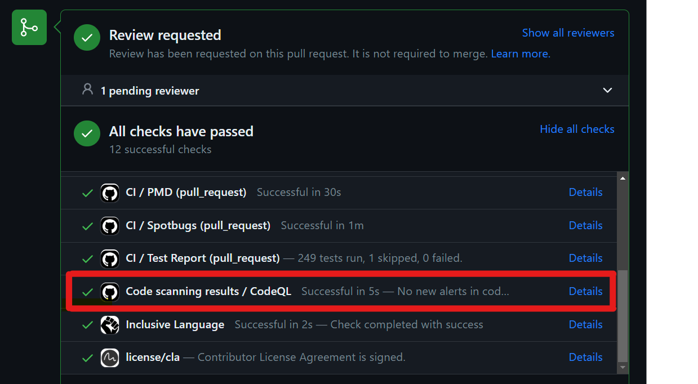
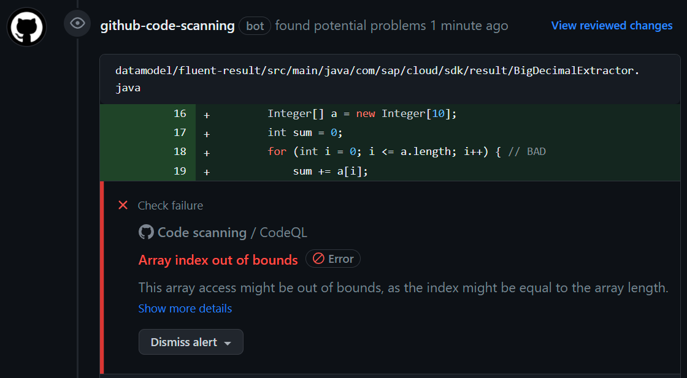
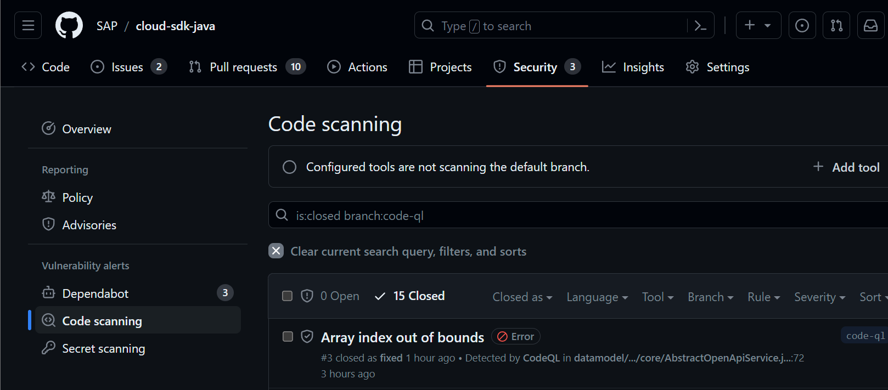

# View CodeQL Scan Results

CodeQL is added as a check to each pull request and new findings lead to a failure of this check.

Note, this check is added automatically by Github if CodeQL has been executed to analyze the CodeQL scan results.
The CodeQL step in the Github actions workflow remains marked as a success even if there were any findings.

The CodeQL scan results for PRs are added as PR comments.
CodeQL highlights the lines of code that triggered the result and offers the possibility to dismiss the findings right away, e.g., by marking them as a false positive.

To view the CodeQL scan results for all branches where CodeQL has been executed check the [`Code Scanning`](https://github.com/SAP/cloud-sdk-java/security/code-scanning) section of the `Security` tab of the repository.

Note, dismissing a finding on one branch will have an effect on that finding on all branches.
This is useful for dismissing a finding discovered in a pull request scan - you won't have to dismiss it again for the main branch.
However, it also means that you may not mess around with findings on a test branch (e.g., by dismissing them without any reason).
If you test dismissing a finding on a throw-away branch, this finding will be dismissed on all other branches, as well.

More information can be found in the [CodeQL documentation](https://docs.github.com/en/code-security/code-scanning/managing-code-scanning-alerts/about-code-scanning-alerts).
